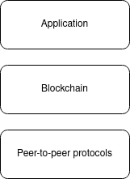

# Installation
Clone our github page on the DAS5 in your home directory.
Next, change the directory to the application directory and run `make` to build the project.
Cleaning the project can be performed by executing `make clean` in the same folder.

# Draw.io Pictures
To edit the images, go to draw.io and load them.

The envisioned system model:

The peer-to-peer blockchain model:

