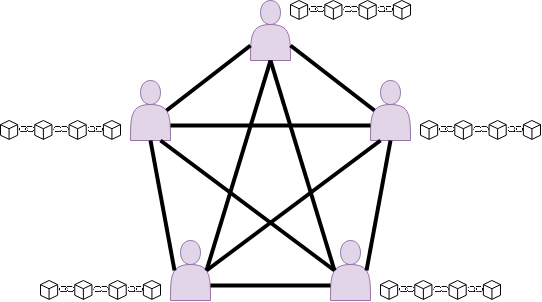

[comment]: # (Author: Miguel Blom)

# Installation
Clone our github page on the DAS5 in your home directory.
Next, change the directory to the application directory and run `make` to build the project.
Cleaning the project can be performed by executing `make clean` in the same folder.

Note: If not building on the DAS5, remove the -fPIC flag for the make targets p2p/common.o, p2p/db.o, p2p/crc.o and p2p/queue.o.

# Execution
For instance, we can run 2 peers (and 1 tracker making 3 in total), allocated for 10 minutes.
We will process 100 transactions distributed uniformly random over the peers.
The peers will be started 5 seconds apart.
`./start_das5.sh 3 00:10:00 100 5`

For our first experiment, we can simply run the script:
`start_das5_exp_perf.sh`
Which measures the throughput of the transactions as a function of the number of transactions used in each block. If the latter value is set to be higher, we have bigger blocks and less messages and vice versa.

For our second experiment, we can run the script:
`start_das5_exp_scalab.sh`
Which measures the time it takes for a peer that joins the network to be fully updated with the state of the blockchain, as a function of the number of peers in the network.

# Draw.io Pictures
To edit the images, go to draw.io and load them.

The envisioned system model:

The peer-to-peer blockchain model:

